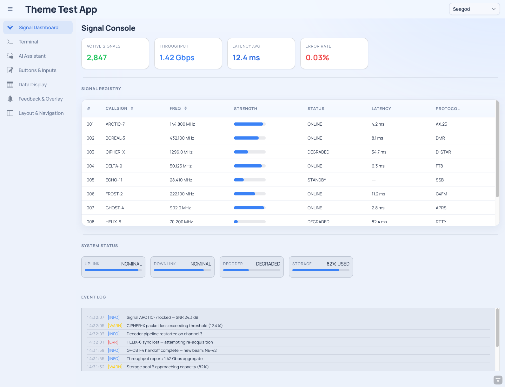
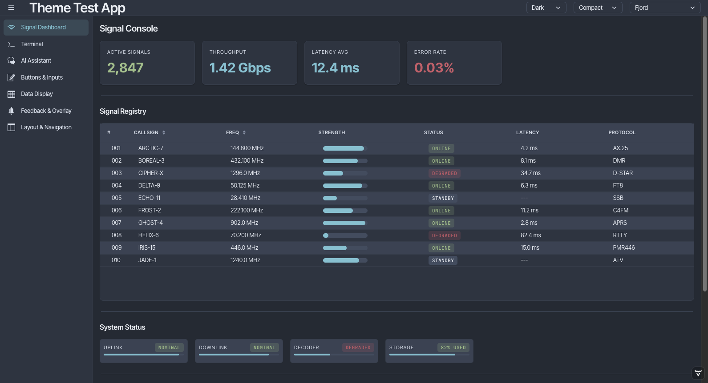
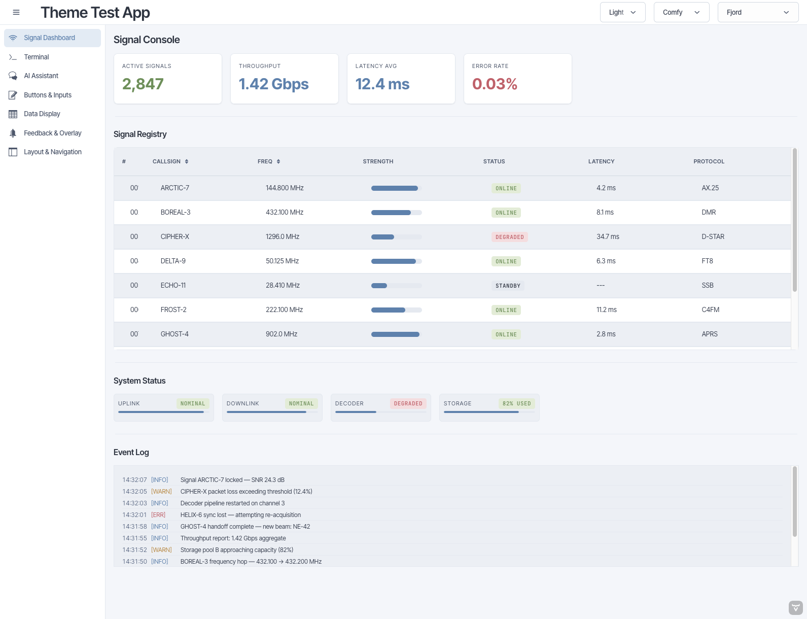
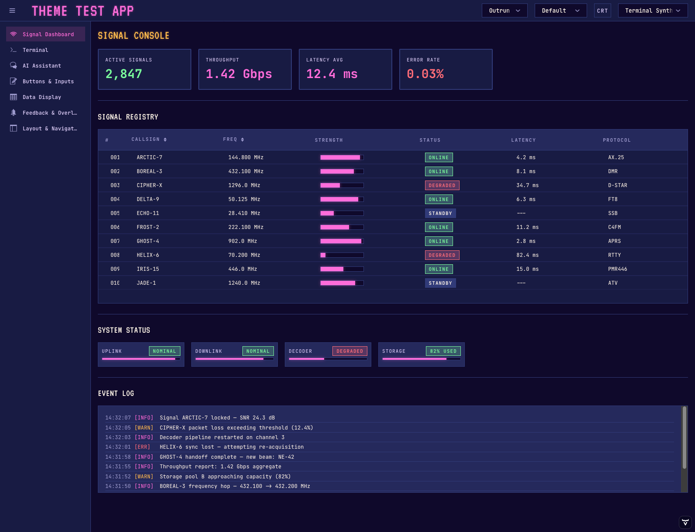
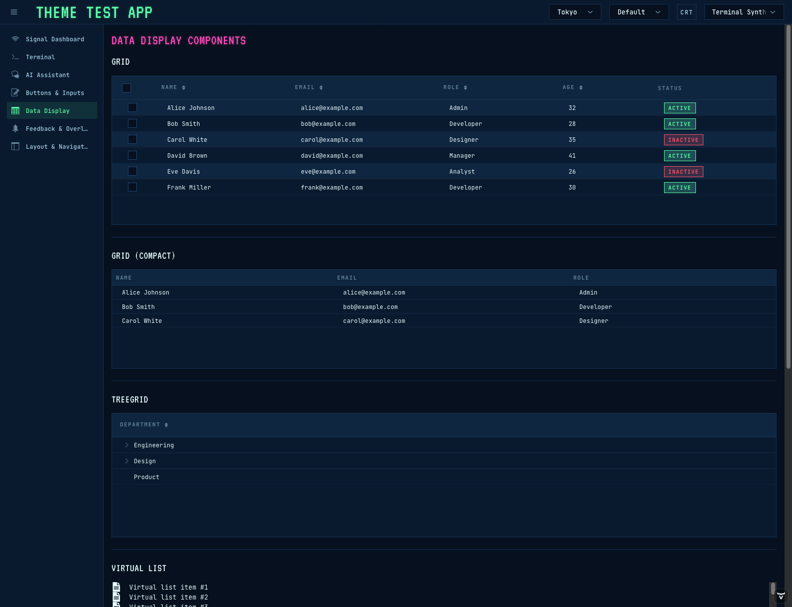
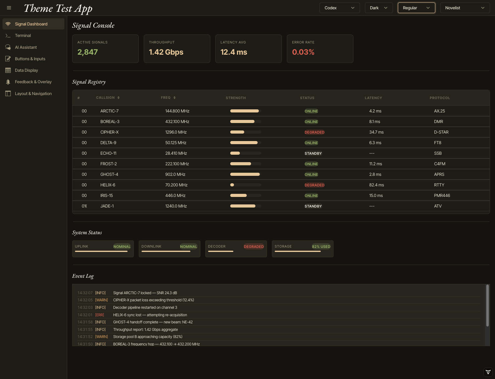
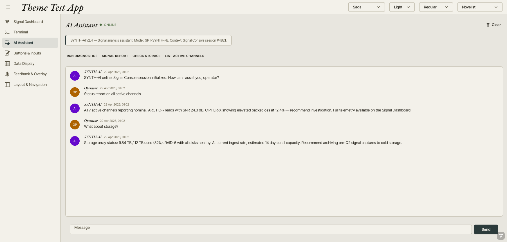

# Vaadin Themes

A small collection of packaged Vaadin 24 Lumo-based themes, each published as a Maven module and previewable in the included test app.

## Themes

### Seagod



### Fjord




### Terminal Synth




### Novelist




## Use a theme

Add the theme module as a dependency:

```xml
<dependency>
  <groupId>org.antoined</groupId>
  <artifactId>theme-fjord</artifactId>
  <version>1.0.0-SNAPSHOT</version>
</dependency>
```

Then select it in your Vaadin app:

```java
@Theme("fjord")
public class AppShell implements AppShellConfigurator {
}
```

Available theme names: `seagod`, `fjord`, `terminal-synth`, `novelist`.

## Build

```bash
mvn install
```

Run the preview app:

```bash
mvn spring-boot:run -pl test-app
```
