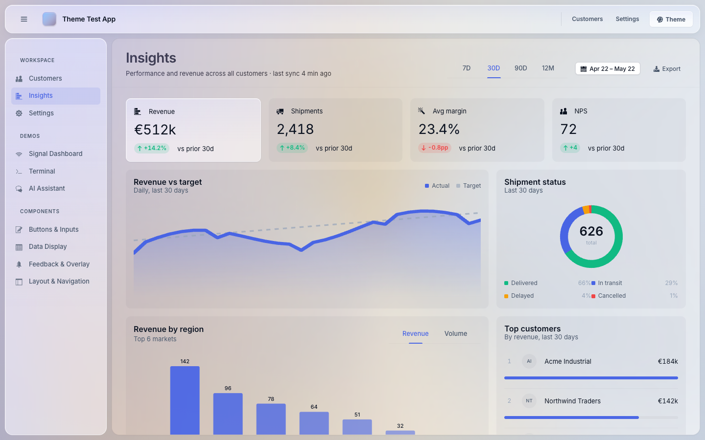
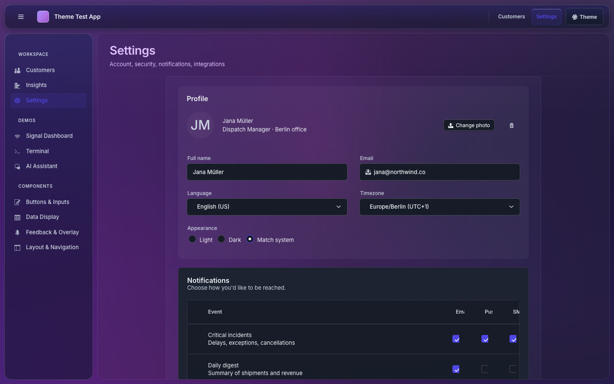
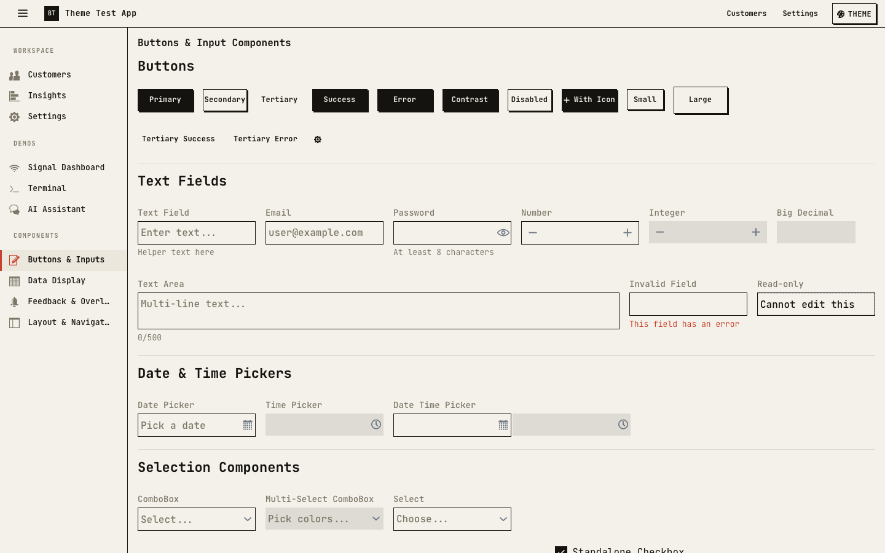
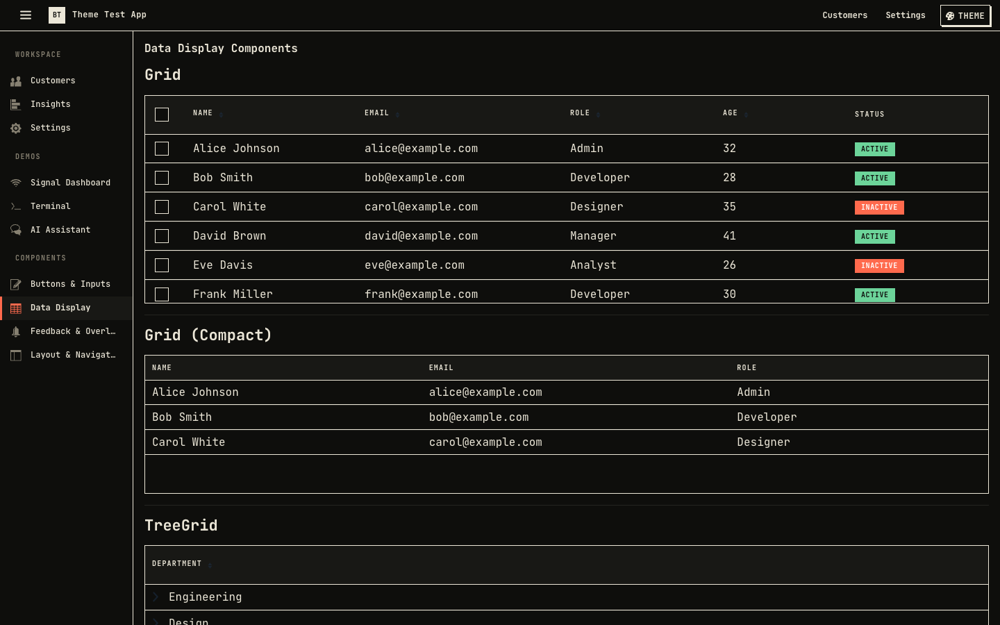
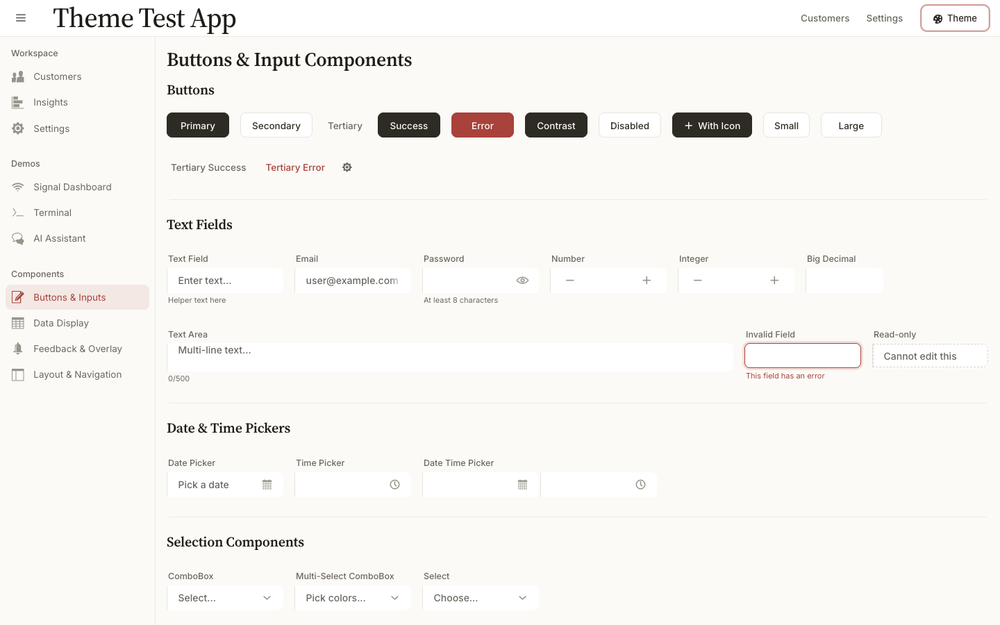
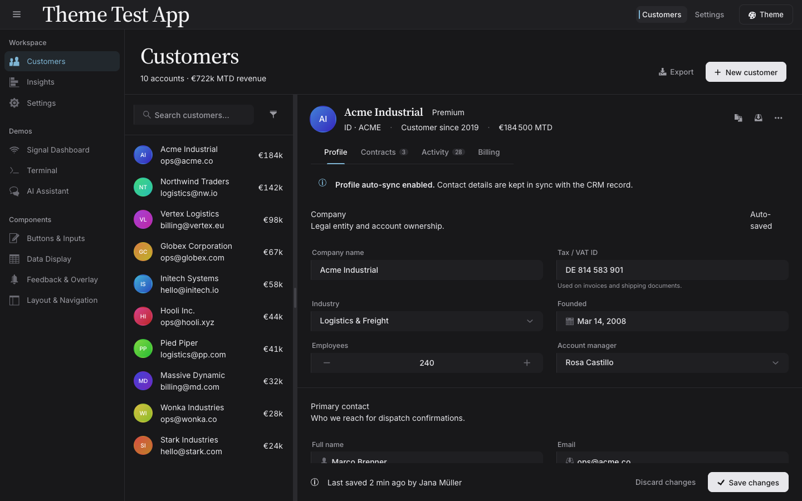
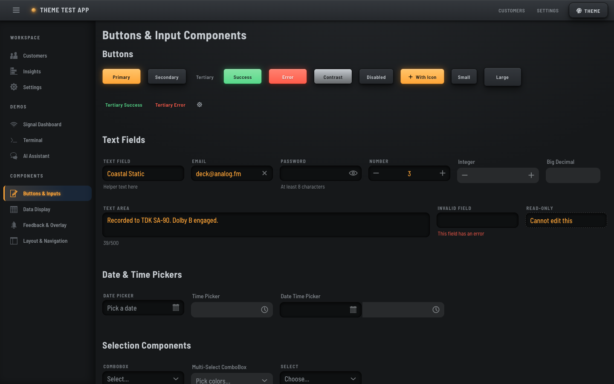
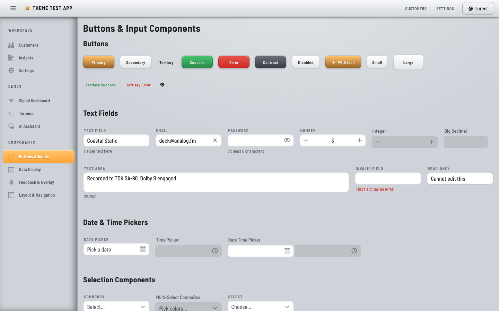

# Vaadin Themes

A small collection of packaged Vaadin 24 Lumo-based themes, each published as a Maven module and previewable in the
included test app.

## Themes

### Seagod


### Fjord


Fjord's palette names and raw color scale are based on the open-source [Nord theme](https://www.nordtheme.com/). Thanks
to the Nord maintainers for publishing such a clear, reusable color system.

### Terminal Synth


### Novelist


### Glass




### Brutalist




### Anything




A Notion-adjacent, serif-led theme. Source Serif 4 across display + body, Inter for UI chrome, single accent rationed
to focus rings / active rails / selected rows. Five paper-stock palettes (Paper / Bone / Linen / Sage / Slate) × light
+ dark, six curated accent swatches (Oxblood / Forest / Ink blue / Brass / Plum / Graphite), and three densities.
Inputs render as a single left filet at rest and snap to a full frame on focus — manuscript-margin until you engage.
Imported from the Anything design system authored in Claude Design.

### Analog




A 90s hi-fi, skeuomorphic instrument panel. Charcoal plastic body with deep recessed bevels, engraved
Barlow Semi Condensed labels, and black-glass wells whose typed values glow like a lit readout. Two tweaks ride on the
`<html>` element: **Glow** swaps the backlight accent (Amber / VFD Green / Ice Cyan / Alert Red — only the glow
changes, the graphite body stays put), and **Finish** flips between Graphite and a 2000s-Apple **Aqua** light mode —
brushed aluminium, glossy gel buttons, pinstripes, and candy-stripe progress (second screenshot). The two compose, so
the accent tints Aqua's gels and selections. Imported from the Analog design system authored in Claude Design.

## The `theme` submodule

The `theme` submodule provides the runtime theme model and ready-made Vaadin components for choosing a theme. It
deliberately does not ship a global catalog or initial value. Each theme module exposes its own `ThemeDefinition`, and
each application decides which definitions to expose and in which order.

Add the shared module, plus whichever theme modules your app wants to offer:

```xml

<dependency>
    <groupId>org.antoined</groupId>
    <artifactId>theme</artifactId>
    <version>1.0.0-SNAPSHOT</version>
</dependency>
<dependency>
<groupId>org.antoined</groupId>
<artifactId>theme-glass</artifactId>
<version>1.0.0-SNAPSHOT</version>
</dependency>
```

Build the catalog in your app by picking the definitions you want:

```java
private List<ThemeDefinition> themeDefinitions() {
    return List.of(
            SeagodTheme.definition(),
            FjordTheme.definition(),
            GlassTheme.definition(),
            BrutalistTheme.definition());
}
```

External themes integrate the same way. A theme module only needs to provide a stylesheet and a `ThemeDefinition`
implementation or factory:

```java
public final class AcmeTheme {
    public static final String ID = "acme";
    public static final String STYLESHEET = "/themes/acme/styles.css";

    public static ThemeDefinition definition() {
        return BasicThemeDefinition.of(ID, "Acme", STYLESHEET, List.of(
                BasicThemeOption.builder("mode", "Mode")
                        .control(ThemeOptionControl.SELECT)
                        .target(ThemeOptionTarget.ROOT_THEME_TOKEN)
                        .values(
                                ThemeOptionValue.of("light", "Light", ""),
                                ThemeOptionValue.of("dark", "Dark", "dark"))
                        .build()));
    }
}
```

Theme options can target root theme tokens, root `data-*` attributes, root CSS variables, `AppLayout` theme tokens, or a
custom action. This lets a theme expose tweaks such as palette, density, mode, background mode, glass strength, or
custom color variables without the app knowing the CSS details.

Use `ThemeSwitcherPopover` when the switcher belongs in a top bar and should stay compact:

```java
public class MainLayout extends AppLayout {
    public MainLayout() {
        var themeSwitcher = new ThemeSwitcherPopover(themeDefinitions(), this);
        themeSwitcher.setSelectedThemeStorageKey("selected-theme");
        themeSwitcher.setSelectedTheme(GlassTheme.ID);
        themeSwitcher.setPersistenceEnabled(true);

        addToNavbar(themeSwitcher);
    }
}
```

Pass the current `AppLayout` when a theme has options that target the shell layout. Enable persistence to store the
selected theme in `localStorage`; persistent options are stored under `vaadin-theme:<theme-id>:<option-key>` unless the
option declares a custom storage key.

For an always-visible control surface, use `ThemeSwitcher` directly:

```java
var switcher = new ThemeSwitcher(themeDefinitions(), this);
switcher.

setPresentation(ThemeSwitcher.Presentation.TOOLBAR);
switcher.

setSelectedTheme(FjordTheme.ID);
switcher.

setPersistenceEnabled(true);
```

Both switcher components support `addThemeChangeListener(...)` and `setOptionValue(...)`, which is useful for applying
app-specific preview defaults after a theme is selected.

## Use a theme

Add the theme module as a dependency:

```xml

<dependency>
    <groupId>org.antoined</groupId>
    <artifactId>theme-fjord</artifactId>
    <version>1.0.0-SNAPSHOT</version>
</dependency>
```

Then either use the theme switcher or use it directly as any other Vaadin theme.

```java

@Theme("fjord")
public class AppShell implements AppShellConfigurator {
}
```

Available theme names: `seagod`, `fjord`, `terminal-synth`, `novelist`, `glass`, `brutalist`, `anything`, `analog`.

## Build

```bash
mvn install
```

Run the preview app:

```bash
mvn spring-boot:run -pl test-app
```
